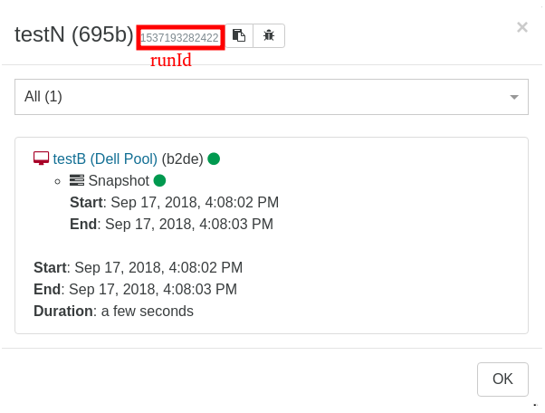
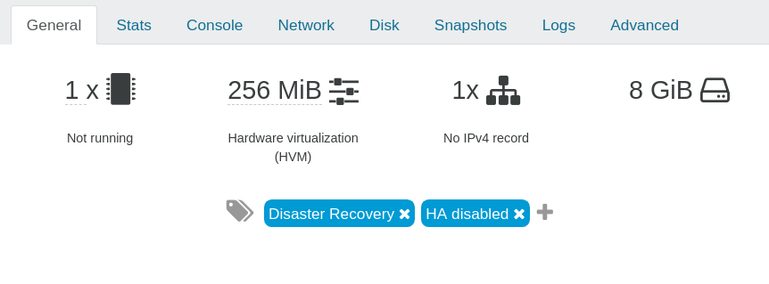
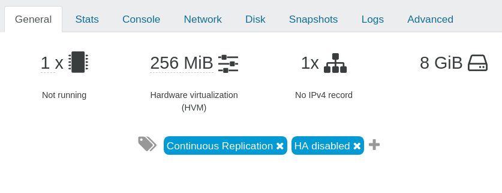

# Concepts

This section is dedicated to all general concepts about Xen Orchestra backups.

## Interface

### Overview

This is the welcome panel for the backup view. It recaps all existing scheduled jobs. This is also where the backup logs are displayed.

### Logs

All the scheduled operations (backup, snapshots and even DR) are displayed in the main backup view.

A successful backup task will be displayed in green, a faulty one in red. You can click on the arrow to see each entry detail.

You also have a filter to search anything related to these logs.

:::tip
Logs are not "live" tasks. If you restart XOA during a backup, the log associated with the job will stay in orange (in progress), because it wasn't finished. It will stay forever unfinished because the job was cut in the middle.
:::

### Backups execution

Each backups' job execution is identified by a `runId`. You can find this `runId` in its detailed log.



## Schedule

> :construction_worker: This section needs to be completed: screenshots and how-to :construction_worker:

## Smart Backup

There are two ways to select which VMs will be backed up:

1. Manually selecting multiple VM's
1. Smart backup

Picking VMs manually can be a limitation if your environment moves fast (i.e. having new VMs you need to backup often). In that situation you would previously need to constantly go back and edit the backup job to add new VM's.

But thanks to _smart backup_, you now have more flexibility: you won't select specific VMs, but VMs status/tag/placement **at the time backup job will be executed**. Let's see some examples!

### Backup all VMs on a pool

This job will backup all VMs on a pool "Lab Pool" when scheduled:


It means: **every VM existing on this pool at the time of the backup job will be backed up**. Doesn't matter if you create a new VM, it will be backed up too without editing any backup job.

**You now have the ability to intelligently backup VM's in production pools!**

Want to narrow the job a bit? See below.

### Backup filters

You can also:

- backup only running (or halted) VMs when the job is executed
- backup only VMs with a specific tag

Remember the Prod VMs? I added a tag "prod" to each of them:


Now if you do this:


It means any VMs on "Lab Pool" with the "prod" tag will be backed up.

## RAM Enabled bakcup

:::tip
This feature is **only compatible** with XCP-ng 8.0 or more recent. Citrix Hypervisor didn't yet merge our changes, despite we contributed to their code directly.
:::


XCP-ng modified XAPI is now able to create VMs in a `Suspended` state with a `suspend_VDI` property set. When a VM is suspended, all of its memory contents are written into a disk called `suspend_VDI`. When the VM is restored, the `suspend_VDI` is read to recreate the memory of the VM. Once the resuming is done it's as if the VM was never suspended.

### Use cases

It is already possible to snapshot a VM with its RAM, however when restoring a VM, the VM was created in the `Halted` state so it wasn't possible to restore the VM with its RAM. With our XAPI modification a VM can now be created in a `Suspended` state with preset memory contents, so when snapshotting a VM with RAM, the snapshotted VM will also have the RAM contents set.

This can be very useful when you're running a VM that needs RAM coherence to run:

- For instance, snapshotting a Windows VM used to be very tricky for this reason. The Citrix VSS script previously answered part of this problem, when snapshotted, the VM flushed its cache but if it happened that the snapshot had coherence issues, the restored VM would be broken. And the VSS script is no longer available.
- VMs running databases could also need such a feature in order to keep transient transactions.
- A VM can be restored on a different host, now the RAM can be as well.

In a nutshell this functionality can be seen as _hot copy_, similar to _hot migration_ but the original VM is not deleted.

### Continuous replication with RAM

This feature allows you to regularly send a copy of a VM to a target SR. The copied VM will be `Suspended` and ready to be resumed if the original VM encounters issues. As the copied VM is `Suspended`, no reboot will be required, resuming it is much faster.

For instance, if an hourly continuous replication is configured on a VM, if the VM is lost, you can quickly resume a running VM with a memory loss of one hour tops.

:::warning
In order to use this functionality, the CPU of the host the VM is restored on should be the same or more recent than the CPU of the host the VM was originally running on.
:::

### Future of RAM enabled backup

- Better analyze of compatible CPUs to avoid manual compatibility checks
- RAM snapshot using Xen copy-on-write memory capabilities (time to snapshot reduce to almost 0)

## Consistent backup

:::warning
This feature is being deprecated in XCP-ng and Citrix Hypervisor. It's now replaced by RAM enabled backup!
:::

All backup types rely on snapshots. But what about data consistency? By default, Xen Orchestra will try to take a **quiesced snapshot** every time a snapshot is done (and fall back to normal snapshots if it's not possible).

Snapshots of Windows VMs can be quiesced (especially MS SQL or Exchange services) after you have installed Xen Tools in your VMs. However, [there is an extra step to install the VSS provider on windows](https://xen-orchestra.com/blog/xenserver-quiesce-snapshots/). A quiesced snapshot means the operating system will be notified and the cache will be flushed to disks. This way, your backups will always be consistent.

To see if you have quiesced snapshots for a VM, just go into its snapshot tab, then the "info" icon means it is a quiesced snapshot:


The tooltip confirms this:


## Remotes

> Remotes are places where your _backup_ and _delta backup_ files will be stored.

To add a _remote_, go to the **Settings/Remotes** menu.

Supported remote types:

- Local (any folder in XOA filesystem)
- NFS
- SMB (CIFS)

:::warning
The initial "/" or "\\" is automatically added.
:::

### NFS

On your NFS server, authorize XOA's IP address and permissions for subfolders. That's all!

### SMB

We support SMB storage on _Windows Server 2012 R2_.

:::warning
For continuous delta backup, SMB is **NOT** recommended (or only for small VMs, eg < 50GB)
:::

Also, read the UI twice when you add an SMB store. If you have:

- `192.168.1.99` as SMB host
- `Backups` as folder
- no subfolder

You'll have to fill it like this:


:::warning
PATH TO BACKUP is only needed if you have subfolders in your share.
:::

### Local

> **This is for advanced users**. Using the local XOA filesystem without extra mounts/disks will **use the default system disk of XOA**.

If you need to mount an unsupported store (FTP for example), you can always do it manually:

1. mount your remote store inside the XOA filesystem manually, e.g in `/media/myStore`
2. in the web interface, select a "local" store and point it to your `/media/myStore` folder.

Any Debian Linux mount point could be supported this way, until we add further options directly in the web interface.

## Restore a backup

All your scheduled backups are acccessible in the "Restore" view in the backup section of Xen Orchestra.

1. Select your remote and click on the eye icon to see the VMs available
2. Choose the backup you want to restore
3. Select the SR where you want to restore it

:::tip
You can restore your backup even on a brand new host/pool and on brand new hardware.
:::

## File level restore

You can also restore specific files and directories inside a VM. It works with all your existing delta backups.

:::warning
File level restore **is only possible on delta backups**
:::

### Restore a file

Go into the Backup/File restore section:


Then, click on the VM where your files are, and follow the instructions:


That's it! Your chosen file will be restored.

## About backup compression

By default, _Backups_ are compressed (using GZIP or zstd, done on host side). There is no absolute rule but in general uncompressed backups are faster than GZIP backups (but sometimes much larger).

Citrix Hypervisor uses Gzip compression, which is:

- slow (single threaded)
- space efficient
- consumes less bandwidth (helpful if your NFS share is far away)

However, XCP-ng is using `zstd`, which is far better.

:::tip
If you have compression on your NFS share (or destination filesystem like ZFS), you can disable compression in Xen Orchestra.
:::

## Add a disk for local backups

If you want to use XOA to locally store all your backups, you need to attach a large disk to it. This can be done live.

First, after your disk is attached to XOA, you'll have to find the new disk name with `fdisk -l`. It's probably `xvdb`.

Then, create a filesystem on it:

```
mkfs.ext4 /dev/xvdb
```

If you already have backups done, you can move them to the new disk. The orignal backups folder is in `/var/lib/xoa-backups`.

To make the mount point persistent in XOA, edit the `/etc/fstab` file, and add:

```
/dev/xvdb /var/lib/xoa-backups ext4 defaults 0 0
```

This way, without modifying your previous scheduled snapshot, they will be written to this new local mountpoint!

## HA behavior

Replicated VMs HA are taken into account by XCP-ng. To avoid the resultant troubles, HA will be disabled from the replicated VMs and a tag indicating this change will be added.




:::tip
The tag won't be automatically removed by XO on the replicated VMs, even if HA is re-enabled.
:::

## Backup Concurrency

Xen Orchestra 5.20 introduces new tools to manage backup concurrency. Below is an overview of the backup process and ways you can control concurrency in your own environment.

### Backup process

#### 1. Snapshot creation

When you perform a backup in XCP-ng/XenServer, the first operation performed is to "freeze" the data at a specific time - this is done by **making a snapshot**. This operation is pretty quick, only a few seconds in general. However it uses a lot of I/O on your storage, therefore more I/O activity means longer times to snapshot. Still, the order of magnitude is seconds per VM.

#### 2. Export

Xen Orchestra will fetch the content of the snapshot made in step 1. This operation can be very long, obviously depending on the size of the snapshot to export: exporting 1TiB of data will take far longer than exporting 1GiB!

#### 3. Snapshot removal

When it's done exporting, we'll remove the snapshot. Note: this operation will trigger a coalesce on your storage in the near future (a coalesce is required every time a snapshot is removed).

### Concurrency

Let's say you want to backup 50 VMs (each with 1x disk) at 3:00 AM. There are **2 different strategies**:

1. backup VM #1 (snapshot, export, delete snapshots) **then** backup VM #2 -> _fully sequential strategy_
2. snapshot all VMs, **then** export all snapshots, **then** delete all snapshots for finished exports -> _fully parallel strategy_

The first purely sequential strategy will lead to a big problem: **you can't predict when a snapshot of your data will occur**. Because you can't predict the first VM export time (let's say 3 hours), then your second VM will have its snapshot taken 3 hours later, at 6 AM. We assume that's not what you meant when you specified "backup everything at 3 AM". You would end up with data from 6 AM (and later) for other VMs.

Strategy number 2 is better in this aspect: all the snapshots will be taken at 3 AM. However **it's risky without limits**: it means potentially doing 50 snapshots or more at once on the same storage. **Since XenServer doesn't have a queue**, it will try to do all of them at once. This is also prone to race conditions and could cause crashes on your storage.

So what's the best choice? Continue below to learn how to best configure concurrency for your needs.

#### Best choice

By default the _parallel strategy_ is, on paper, the most logical one. But we need to give it some limits on concurrency.

> Note: Xen Orchestra can be connected to multiple pools at once. So the concurrency number applies **per pool**.

Each step has its own concurrency to fit its requirements:

- **snapshot process** needs to be performed with the lowest concurrency possible. 2 is a good compromise: one snapshot is fast, but a stuck snapshot won't block the whole job. That's why a concurrency of 2 is not too bad on your storage. Basically, at 3 AM, we'll do all the VM snapshots needed, 2 at a time.
- **disk export process** is bottlenecked by XCP-ng/XenServer - so to get the most of it, you can use up to 12 in parallel. As soon a snapshot is done, the export process will start, until reaching 12 at once. Then as soon as one in those 12 is finished, another one will appear until there is nothing more to export.
- **VM export process:** the 12 disk export limit mentioned above applies to VDI exports, which happen during delta exports. For full VM exports (for example, for full backup job types), there is a built in limit of 2. This means if you have a full backup job of 6 VMs, only 2 will be exported at once.
- **snapshot deletion** can't happen all at once because the previous step durations are random - no need to implement concurrency on this one.

This is how it currently works in Xen Orchestra. But sometimes, you also want to have _sequential_ backups combined with the _parallel strategy_. That's why we introduced a sequential option in the advanced section of backup-ng:

> Note: 0 means it will be fully **parallel** for all VMs.

If you job contains 50 VMs for example, you could specify a sequential backup with a limit of "25 at once" (enter 25 in the concurrency field). This means at 3 AM, we'll do 25 snapshots (2 at a time), then exports. As soon as the first VM backup is completely finished (snapshot removed), then we'll start the 26th and so on, to always keep a max of 25x VM backups going in parallel.
