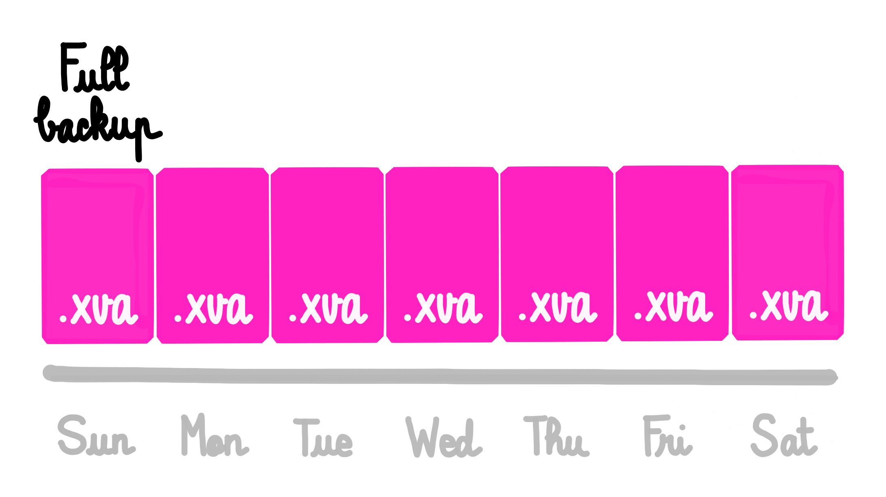
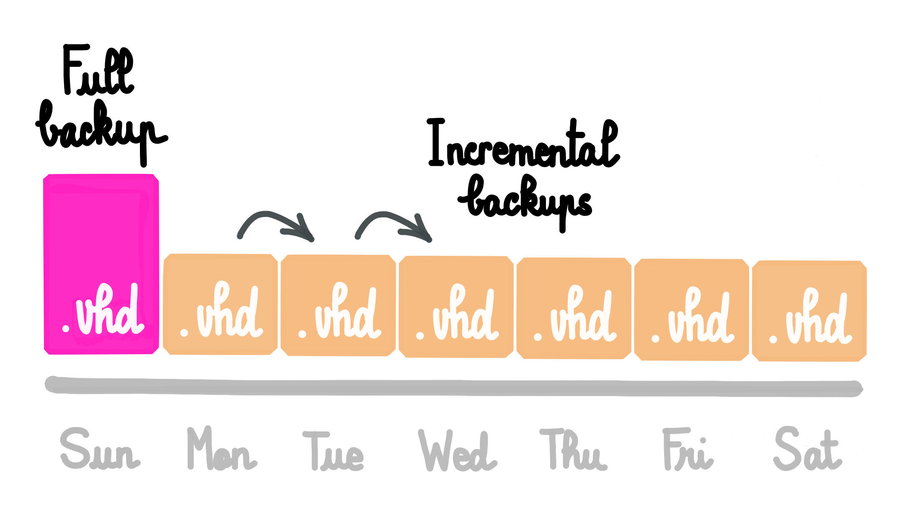
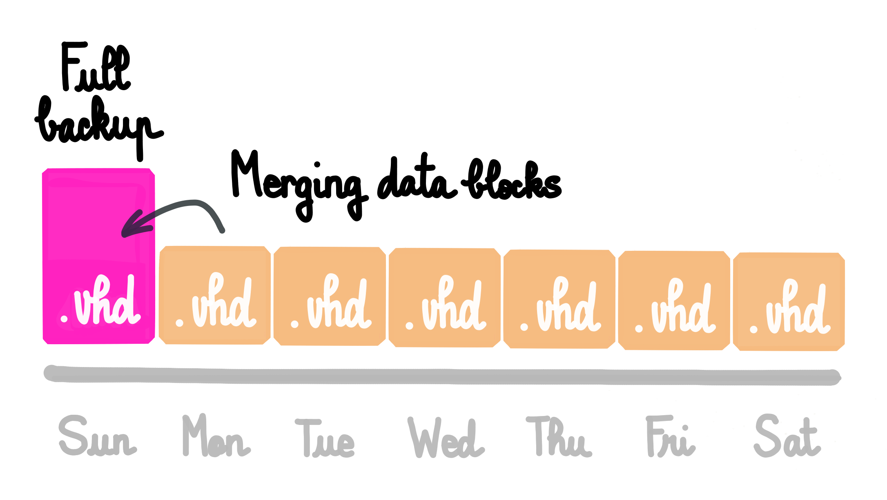
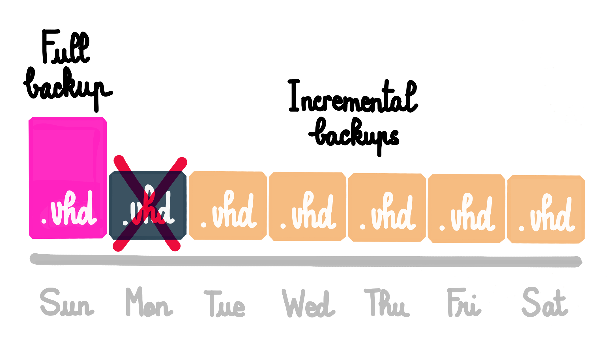

# Continuous Delta backups

You can export only the delta (difference) between your current VM disks and a previous snapshot (called here the _reference_). They are called _continuous_ because you'll **never export a full backup** after the first one.

## Introduction

Full backups can be represented like this:

It means huge files for each backup. Delta backups will only export the difference between the previous backup:

You can imagine making your first initial full backup during a weekend, and then only delta backups every night. It combines the flexibility of snapshots and the power of full backups, because:

- delta are stored somewhere else than the current VM storage
- they are small
- quick to create
- easy to restore

So, if you want to rollback your VM to a previous state, the cost is only one snapshot on your SR (far less than the [rolling snapshot](rolling_snapshot.md) mechanism).

Even if you lost your whole SR or VM, XOA will restore your VM entirely and automatically, at any date of backup.

You can even imagine using this to backup more often! Because deltas will be smaller, and will **always be deltas**.

### Continuous

They are called continuous because you'll **never export a full backup** after the first one. We'll merge the oldest delta into the full:

This way we can go "forward" and remove this oldest VHD after the merge:

## Create Delta backup

Just go into your "Backup" view, and select Delta Backup. Then, it's the same as a normal backup.

## Snapshots

Unlike other types of backup jobs which delete the associated snapshot when the job is done and it has been exported, delta backups always keep a snapshot of every VM in the backup job, and uses it for the delta. Do not delete these snapshots!

## Exclude disks

During a delta backup job, you can avoid saving all disks of the VM. To do that is trivial: just edit the VM disk name and add `[NOBAK]` before the current name, eg: `data-disk` will become `[NOBAK] data-disk` (with a space or not, doesn't matter).

The disks marked with `[NOBAK]` will be now ignored in all following backups.

## Delta backup initial seed

If you don't want to do an initial full directly toward the destination, you can create a local delta backup first, then transfer the files to your destination.

Then, only the diff will be sent.

1. create a delta backup job to the first remote
1. run the backup (full)
1. edit the job to target the other remote
1. copy files from the first remote to the other one
1. run the backup (delta)
